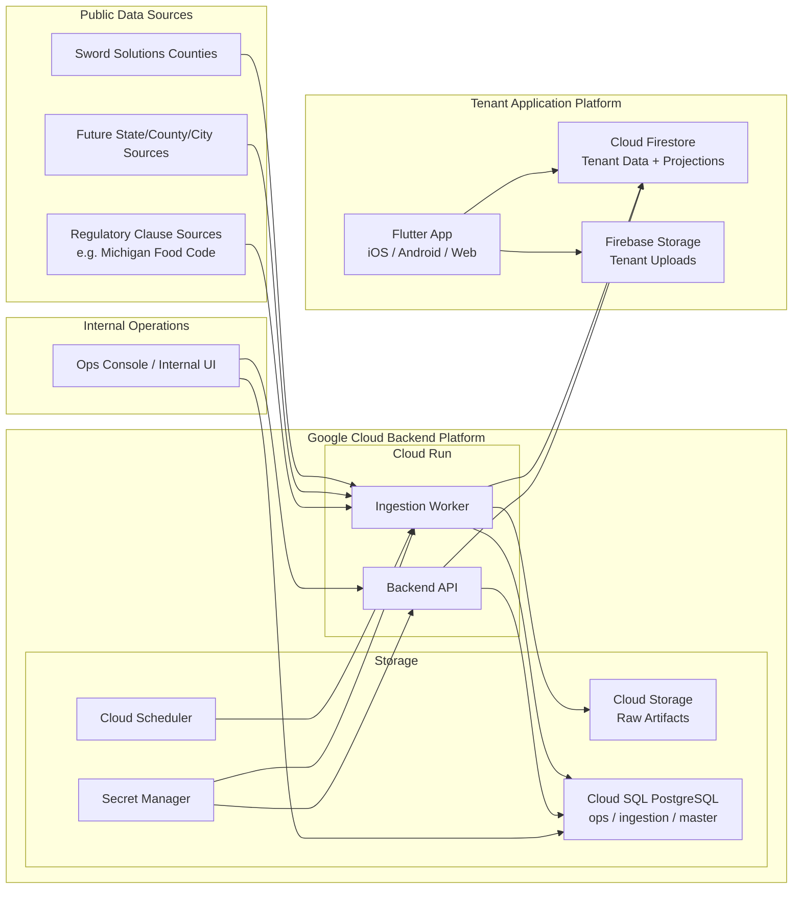
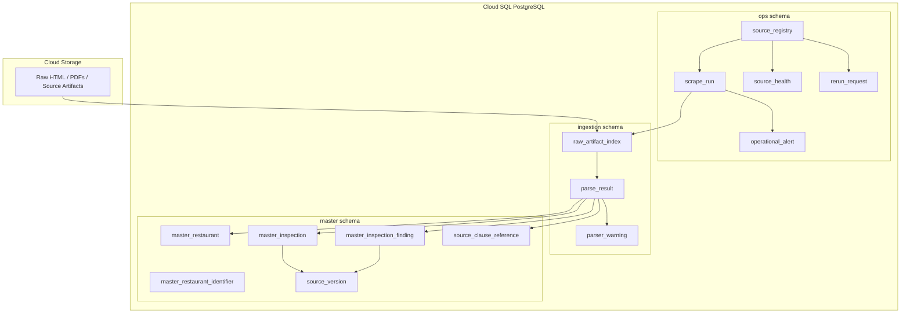
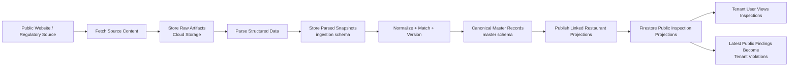
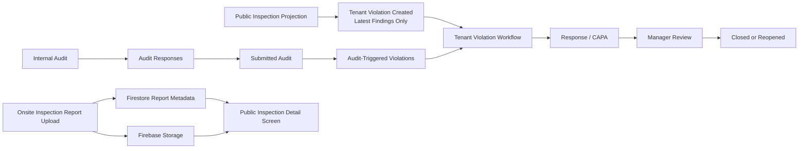
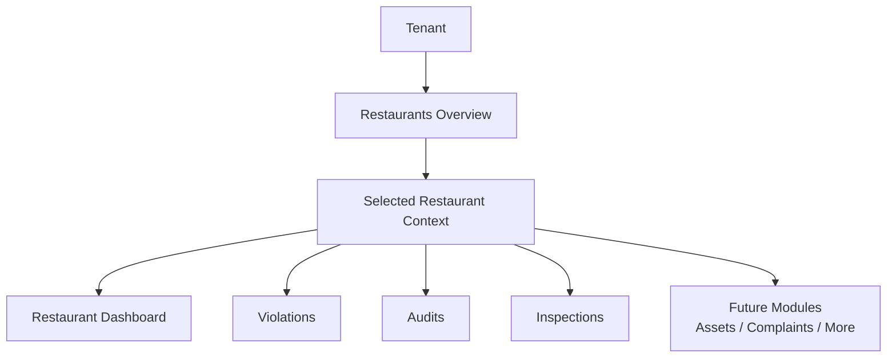

# FiScore Architecture Diagram

## Purpose

This document provides high-level architecture diagrams for the FiScore platform.

The goals are to:

- visualize the separation between the tenant application and the public-data backend
- clarify how data moves through the ingestion pipeline
- show where different storage layers live
- support future implementation, onboarding, and architecture discussions

This document is intended to complement the written architecture and schema documents, not replace them.

## Architecture Principles Reflected Here

- the tenant app and the ingestion/master-data platform are separate systems
- public source data is processed through raw, parsed, and canonical layers
- tenant users only see data for linked restaurants
- tenant workflows remain private to the tenant
- Google Cloud is the initial backend hosting direction

## 1. High-Level System Architecture

## Diagram Explanation

### Public Sources

These are the external websites, portals, and regulatory reference sources FiScore ingests from.

Examples:

- Sword Solutions county inspection sites
- future statewide or county-specific public health sources
- regulatory code sources for clause reference libraries

### Google Cloud Backend Platform

This is the ingestion and master-data platform.

Main responsibilities:

- fetch and store raw source artifacts
- parse source data
- normalize records into canonical master data
- maintain operations tracking
- publish tenant-facing projections

### Tenant Application Platform

This is the customer-facing app stack.

Main responsibilities:

- tenant onboarding
- restaurant overview and drill-in
- audit workflows
- violation workflows
- public inspection viewing
- tenant-uploaded onsite report handling

### Internal Operations

This is the internal-only operational layer for running and monitoring the ingestion platform.

## 2. Backend Data Layer Architecture

## Diagram Explanation

### `ops` Schema

Tracks:

- source definitions
- run history
- health state
- alerts
- rerun controls

### `ingestion` Schema

Tracks:

- raw artifact metadata
- parsed snapshots
- parser warnings

### `master` Schema

Stores canonical public data:

- restaurants
- identifiers
- inspections
- findings
- source-specific clause references
- source versions

## 3. Public Data Flow to Tenant App

## Diagram Explanation

This shows the public-data path:

1. fetch source data
2. store raw artifacts
3. parse into structured snapshots
4. normalize into canonical master records
5. publish only linked restaurant data into Firestore
6. expose it inside the tenant app

## 4. Tenant Workflow Data Flow

## Diagram Explanation

This shows the tenant-private workflow path:

- public findings can create tenant violations
- internal audits can also create tenant violations
- tenant users respond privately
- managers review and close
- onsite uploaded inspection reports stay in the tenant document/file layer

## 5. Restaurant-Centered App Model

## Diagram Explanation

This reflects the updated product direction:

- users can see a portfolio-level restaurant overview
- detailed work still happens in one selected restaurant context at a time
- the app is designed to grow beyond inspections and violations

## Recommended Reading Order with Other Docs

This diagram set pairs especially well with:

- `MASTER_DATA_ARCHITECTURE.md`
- `MASTER_DATA_SCHEMA.md`
- `FIRESTORE_SCHEMA.md`
- `APP_NAVIGATION.md`
- `WORKFLOWS.md`
- `BACKEND_BOOTSTRAP_CHECKLIST.md`

## Summary

FiScore is best understood as two connected platforms:

- a tenant-facing restaurant operations application
- a Google Cloud-hosted ingestion and master-data backend

Public data flows from websites and regulatory sources into raw artifacts, parsed snapshots, and canonical master records before being projected into tenant-facing Firestore documents for linked restaurants. Tenant users then operate privately on that projected data through audits, violations, remediation workflows, and uploaded onsite documents.

